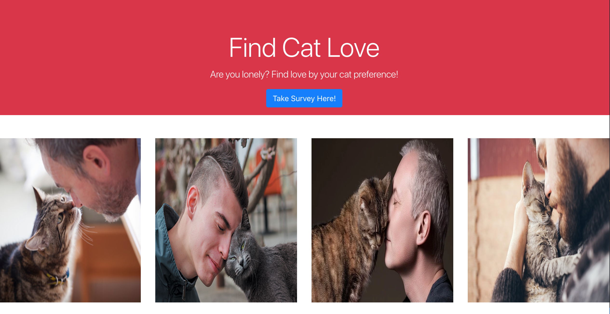
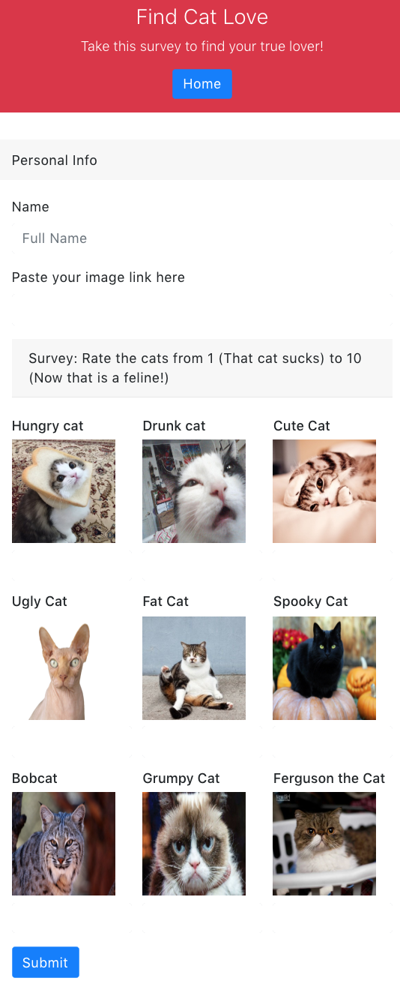

# Friend (Cat) Finder
---

##   `server.js`

To start our Friend Finder app, we need to start a server so as to send and receive request from the webpage.

1. To make it easier, we will start with requiring an package called `express`. This will be used to set up our server.

2. We then create a **PORT** that will be used, whether a default is set for our server or if we decide to use 8080. For testing we use 8080 as our port. The server we use online will use its own server.

3. Using the express package we will parse the data.

4. We will then require routers to point our server to certain "routes" to map things out for our pages. (Will explain the routes later.)

5. We then run the server

##   `apiRoutes.js`

This Javascript page will set up the routes for our api's to be sent.

1. We first load our current data from the `friend.js` file, which is an api object that is exported over to the `apiRoutes.js`.

2. We will then setup a GET request which will show all the data when the user is sent to the path app/friends


3. Then a POST request is setup where a user will submit some data and will be sent to the server. 

4. Another POST request is setup to remove data.


##   `htmlRoutes.js`

1. A package called path will be required so we can find the the path of our html pages. 

2. We setup a GET request which will show the `survey.html` page for the path /survey

3. We setup a GET request which will show the `home.html` page for the path /*


##   `home.html`

This page is pretty straight forward. It is the homepage of the website that will show "Find Cat Love" as the Title, with a button that leads to the survey page. 





For specific html for the page, please see the comments for the `home.html`.


##   `survey.html`

####   CSS

Just adding a style in which will keep the sizes of the cats at the right size of 275 px by 275 px. 


#### HTML

The html consist of the Instructions with the Home button, the form with the 9 cats and an input field to put a value between 1 and 10 inclusively. Then I have the footer.




For more specifics, please see comments in the `survey.html`


#### Javascript

First jQuery was loaded so the functionality can be used.

We then submitted the data, changed it to numbers, and then submitted it as an object called newFriend:

```javascript
$(".submit").on("click", function (event) {
		event.preventDefault();
		var score1 = parseInt($("#cat1").val())
		var score2 = parseInt($("#cat2").val())
		var score3 = parseInt($("#cat3").val())
		var score4 = parseInt($("#cat4").val())
		var score5 = parseInt($("#cat5").val())
		var score6 = parseInt($("#cat6").val())
		var score7 = parseInt($("#cat7").val())
		var score8 = parseInt($("#cat8").val())
		var score9 = parseInt($("#cat9").val())
```

```javascript
var newFriend = {
			name: $("#name").val().trim(),
			photo: $("#image-link").val().trim(),
			score: [
				score1,
				score2,
				score3,
				score4,
				score5,
				score6,
				score7,
				score8,
				score9
			]
		};
```

Then condition had to be before it is officially sent/posted:

1. Make sure the Name and the photo link isn't empty. If it is, it will send an alert:

```javascript
if (newFriend.name === "" || newFriend.photo === "") {
			alert("Please add or correct your name or link");

		}
```

2. Make sure the scores are numbers, else send an alert to change it:

```javascript
else if (
			isNaN(score1) ||
			isNaN(score2) ||
			isNaN(score3) ||
			isNaN(score4) ||
			isNaN(score5) ||
			isNaN(score6) ||
			isNaN(score7) ||
			isNaN(score8) ||
			isNaN(score9)
		) {
			alert("Please add or correct your score ")
		}
```

3. Make sure the scores are less than 11, else send an alert:

```javascript
else if (
			score1 > 10 ||
			score2 > 10 ||
			score3 > 10 ||
			score4 > 10 ||
			score5 > 10 ||
			score6 > 10 ||
			score7 > 10 ||
			score8 > 10 ||
			score9 > 10
		) {
			alert("Please pick a value between 1 and 10")
		}
```

4. Make sure the scores are non-negative, else send an alert:

```javascript
else if (
	score1 < 0 ||
	score2 < 0 ||
	score3 < 0 ||
	score4 < 0 ||
	score5 < 0 ||
	score6 < 0 ||
	score7 < 0 ||
	score8 < 0 ||
	score9 < 0 
	) {
	alert("Please pick a value between 1 and 10")
		}
```

After all that, we will then post the values:

```javascript
else {
	
	postValues()
	}
```


The postValues() function will post the data on the /api/friends path.

 Our whole goal is to take the scores, add them together, compare that sum with sums of the other scores that other people submit and see which one is the closest. The closest one will then be selected and the image for that pic will pop up to show the match! Our  findMatch() function will do that for us. 

 1. We will make a GET request for all the data (api's) from that path api/friends:

 ```javascript
 $.ajax({ url: "/api/friends", method: "GET" })
	.then(function (tableData) {

		console.log(tableData)

```

2. After the request, we will take each object (or person if that helps) with their scores and take the sum of their score. We will then put each sum for each person in an array called scoreArray:

```javascript
var scoreArray = [];

	for (var i = 0; i < tableData.length; i++) {
		var total = 0;
		for (var j = 0; j < tableData[i].score.length; j++) {
			total = total + parseInt(tableData[i].score[j])
					}
		scoreArray[i] = total
				}
```

3. Then take the last sum of the array (which is the most recent submission) and will subtract the value of each sum of the other objects with that sum. We then take the absolute value to get the smallest nonnegative value and store them in an array called closestScoreArray:

```javascript
var closestScoreArray = []

for (var i = 0; i < scoreArray.length - 1; i++) {
	var value =
	Math.abs(scoreArray[i] - scoreArray[scoreArray.length - 1]);
	closestScoreArray[i] = value;
}
```

4. Then in the closestScoreArray will find the smallest value and find the index of that value:

```javascript
var match = closestScoreArray.indexOf(Math.min.apply(null, closestScoreArray))
```


5. With the index number, we will reference back to the object with that index value and show their name and photo link on the modal using jQuery:

```javascript
$("#ModalLabel").text("You matched with " + tableData[match].name + "!")


$(".modal-body").html("")

$("#Modal").modal('show');
```

6. We then clear the values for the form:

```javascript
$("#cat1").val("")
$("#cat2").val("")
$("#cat3").val("")
$("#cat4").val("")
$("#cat5").val("")
$("#cat6").val("")
$("#cat7").val("")
$("#cat8").val("")
$("#cat9").val("")
```


